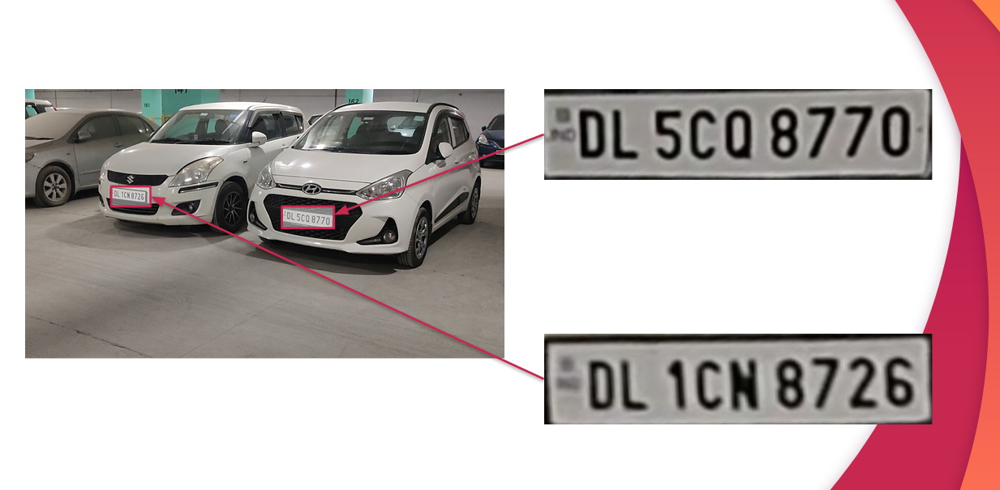
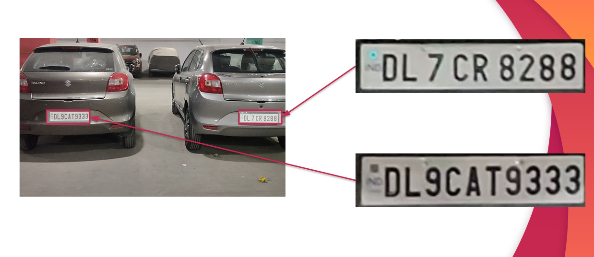

# Vehicle Surveillance

Computer Vision is used to detect and localise the number plates in the camera feed. The retrieved plates are then further processed to retrieve their text.

## Processing pipeline
- Each Frame in the input video is saved into a directory.
- Then each frame is processed with the pre trained ML model to retrive the number plates.
- Next, these retrieved plates are further processed by an online OCR retrieval tool API.
- The retrieved text is then matched against a missing vehicle database.
- If there is a hit, then the plate is displayed in the front end.

## Snapshots

The above snapshots are from a PPT designed for University grading purpose.
